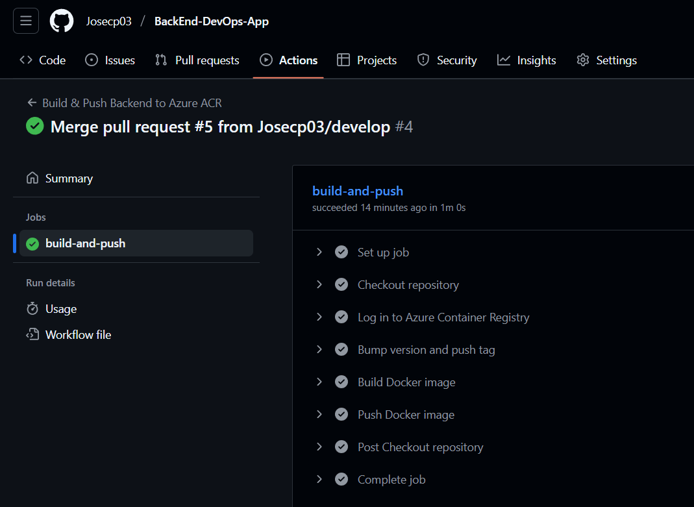
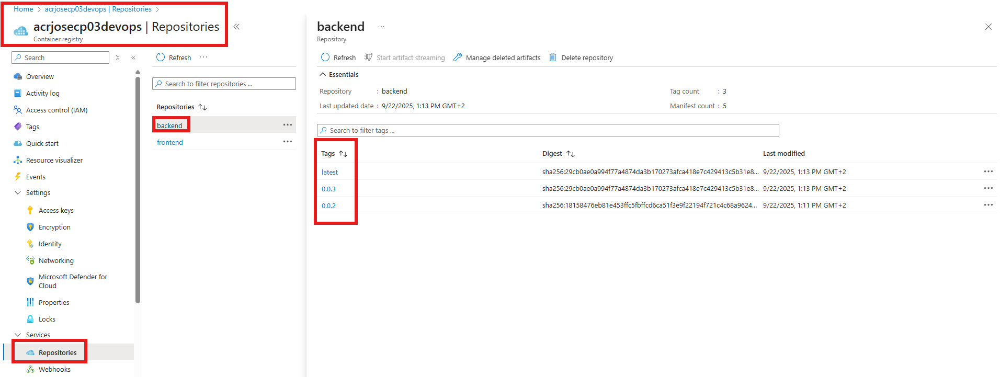

# 🚀 BackEnd Workflow - DevOpsApp

Este documento explica el workflow que he configurado para el backend de mi aplicación.  
El objetivo es detallar cómo funciona el archivo `docker-build.yaml`, encargado de construir y subir la imagen Docker del backend a **Azure Container Registry (ACR)** de forma automática cada vez que se actualiza la rama principal (`main`).  

## 📋 Tabla de contenidos

- [🚀 BackEnd Workflow - DevOpsApp](#-backend-workflow---devopsapp)
  - [📋 Tabla de contenidos](#-tabla-de-contenidos)
  - [📂 Estructura de archivos](#-estructura-de-archivos)
  - [`docker-build.yaml`](#docker-buildyaml)
    - [📖 Explicación breve](#-explicación-breve)
  - [✅ Comprobación](#-comprobación)

---

## 📂 Estructura de archivos

La configuración del workflow se encuentra dentro de la carpeta `.github/workflows`, siguiendo la convención estándar de GitHub Actions:

```
.github/
└── workflows/
    └── docker-build.yaml
```

---

## `docker-build.yaml`

A continuación, se muestra el contenido completo del archivo `docker-build.yaml` utilizado para este proyecto:

```yaml
name: Build & Push Backend to Azure ACR

on:
  push:
    branches:
      - main
    paths:
      - 'src/**'
      - 'pom.xml'
      - 'mvnw'
      - '.mvn/**'
      - 'Dockerfile'
  
  workflow_dispatch: 

permissions:
  contents: write  

env:
  IMAGE_NAME: backend  

jobs:
  build-and-push:
    runs-on: ubuntu-latest
    environment: dev   

    steps:
      - name: Checkout repository
        uses: actions/checkout@v4

      - name: Log in to Azure Container Registry
        uses: azure/docker-login@v1
        with:
          login-server: ${{ vars.REGISTRY }}   
          username: ${{ secrets.AZURE_ACR_USERNAME }}
          password: ${{ secrets.AZURE_ACR_PASSWORD }}

      - name: Bump version and push tag
        id: tag_version
        uses: mathieudutour/github-tag-action@v6.2
        with:
          github_token: ${{ secrets.GITHUB_TOKEN }}
          tag_prefix: ""

      - name: Build Docker image
        run: |
          REGISTRY_CLEAN=$(echo "${{ vars.REGISTRY }}" | tr -d '\r')
          docker build -t $REGISTRY_CLEAN/${{ env.IMAGE_NAME }}:${{ steps.tag_version.outputs.new_tag }} .
          docker tag $REGISTRY_CLEAN/${{ env.IMAGE_NAME }}:${{ steps.tag_version.outputs.new_tag }} $REGISTRY_CLEAN/${{ env.IMAGE_NAME }}:latest

      - name: Push Docker image
        run: |
          REGISTRY_CLEAN=$(echo "${{ vars.REGISTRY }}" | tr -d '\r')
          docker push $REGISTRY_CLEAN/${{ env.IMAGE_NAME }}:${{ steps.tag_version.outputs.new_tag }}
          docker push $REGISTRY_CLEAN/${{ env.IMAGE_NAME }}:latest
```

### 📖 Explicación breve

1. **Disparadores (`on`)**: el workflow se ejecuta al hacer push en `main` o de forma manual con `workflow_dispatch`.
2. **Login en ACR**: se conecta a Azure Container Registry usando credenciales guardadas como secretos en el repositorio.
3. **Versionado automático**: cada ejecución genera un nuevo tag semántico (ej. `1.0.0`, `1.0.1`), eliminando el prefijo `v`.
4. **Build & Push**: construye la imagen Docker del backend y la sube al ACR con dos etiquetas:

   * La versión generada (`0.0.1`)
   * `latest`

---

## ✅ Comprobación

Para validar que todo funciona correctamente:

* Se revisa en **GitHub Actions** que el job haya terminado con éxito:
  
    

* En el portal de **Azure Container Registry**, se puede comprobar que la nueva imagen aparece con la etiqueta generada y también con `latest`.

    
    

